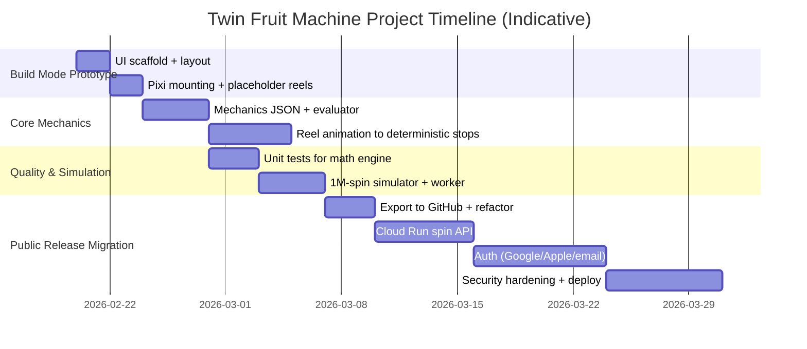

# Building a Realistic Twin Fruit-Machine Demo in React With Google AI Studio Build Mode and a Path to a Secure Public Release

## Executive summary

A “Random Runner–style” twin fruit-machine is, mechanically, two classic 3×3 reel sets on the same screen. Public descriptions consistently characterize it as **two simultaneous 3‑reel, 3‑row games**, each with **5 paylines**, with an option to play one side or both, and (in some write-ups) an option to **synchronize** the two sets. citeturn13view0turn13view2turn8search8 That said, **primary mechanics artifacts** (official reel strips, paytables, RTP certificates, feature logic) are generally **not publicly accessible**, and many third‑party review sites contain **inconsistencies or outright misattributions**, so your demo should be designed as an **original “twin classic fruit machine”** that *resembles the genre* without copying proprietary math, art, or exact rules. citeturn8search27turn13view2turn13view0

For a realistic web demo, React is well-suited for UI/state orchestration, while PixiJS is a strong choice for authentic reel animation (masking, sprite batching) using GPU-accelerated renderers (WebGL/WebGPU). citeturn15view0turn14view3 Google AI Studio Build mode can rapidly scaffold a React web app and iteratively modify it in-browser; it also documents key constraints: generated apps are client-side, code is visible when shared, API keys must not be embedded, and local projects cannot be imported back into AI Studio. citeturn1view0 These constraints shape a pragmatic workflow: prototype and iterate in Build mode, then export to GitHub/local dev for “real engineering,” and finally deploy a server-authoritative backend (Cloud Run) with OAuth/email auth integration and secure token verification. citeturn1view0turn11search0turn11search2

This report provides: a vetted summary of public “Random Runner” claims and gaps; a detailed developer plan including a mechanics JSON schema, paylines, reel-strip design, RNG models, and a 1M-spin simulator; exact Build mode prompts (starter + follow-ups); a step-by-step migration to a secure public release supporting Google/Apple/email auth; and decision tables plus mermaid diagrams.

## Public Random Runner and Stakelogic-style mechanics found, gaps, and constraints

### What can be inferred from public descriptions

Public pages that reference **Stakelogic’s “Random Runner”** describe a classic layout with **3 reels × 3 rows**, **5 paylines**, and *two* side-by-side copies of the game on one screen, with the ability to play one side or both. citeturn13view0turn13view2turn8search8

Multiple sources also emphasize a “twin” concept: synchronized or paired play on two reel sets (sometimes described as “synchronized spinning action”). citeturn13view0turn8search5turn8search4 One detailed (third-party) write-up claims an option exists to make “both sets of reels show the same symbols,” describing normal play as independent and “sync” as effectively doubling stakes on one outcome. citeturn13view2

Some pages list an RTP number (often 95.49%) and a release date (often Oct 16, 2015), but these are typically **not backed by primary compliance/certificate links in the public pages** and should be treated as *unverified metadata* rather than specifications to copy. citeturn13view0turn8search1turn8search2

### Reliability gaps and why they matter for implementation

There is no broadly available primary packet of: reel strips, symbol weights, exact paytable tables, feature probabilities, “sync” logic, or certified RTP documentation. The sources that do provide specific pay multipliers or feature details are typically editorial. citeturn13view2turn8search1

There is active naming collision/confusion in the ecosystem: multiple “Random Runner” and “Random Runner Twin Player” listings exist under different providers, and at least one public page appears to misattribute “Random Runner” to a different studio entirely. citeturn8search3turn8search27

**Practical conclusion:** Build an **original** twin classic fruit machine with a “Random Runner–style” *presentation* (two 3×3 windows, 5 paylines each, optional synced mode), but do not attempt to replicate proprietary math/art 1:1.

### Legal and ethical constraints for a public demo

A “realistic” slot demo can still be safe and compliant if you treat it as a **game-genre UI/animation exercise** rather than a gambling product: avoid proprietary assets and trademarks, avoid reverse engineering, and clearly label it as a demo/educational build. This is also consistent with how reputable open-source slot demos frame themselves (e.g., “proof of concept,” “not for production gambling”). citeturn2search10turn21search2

## Reference stack choices for a realistic twin-machine in React

### Why React plus PixiJS is a strong fit

React provides a well-understood component model and state management for controls, modals, settings, and routing, while PixiJS provides a high-performance 2D rendering engine designed for rich interactive graphics. citeturn14view0turn14view3 PixiJS renderers draw scenes using **WebGL/WebGL2** or **WebGPU**, which is well-aligned with “realistic” reel animation (continuous sprite movement, masks, glow filters). citeturn15view0

PixiJS also includes a frame-ticked update mechanism (Ticker) suitable for game loops and animation timing control (including min/max FPS clamping). citeturn25view0

### Two viable integration patterns

Using PixiJS **imperatively** inside React (mount a canvas in a `useEffect`) works with essentially any React setup and maps closely to Pixi’s official usage patterns. citeturn14view3

Using `@pixi/react` offers a declarative integration, and PixiJS explicitly documents this ecosystem path—however, PixiJS notes that **PixiJS React requires React 19 or higher**, and `extend` is used to register only the Pixi components you need (reducing bundle size). citeturn16view2turn16view0turn16view1

In early AI Studio Build mode prototyping (where you don’t control every dependency detail), the imperative approach is typically the least fragile; you can refactor to `@pixi/react` after export if/when your React version is confirmed compatible.

### Rendering alternatives and when they win

Some open-source slot demos deliberately use **DOM + Web Animations API** to achieve attractive results with tiny bundles (and it’s a credible reference for control panels and “fruit machine” UI styling). citeturn2search10turn24search3 However, for continuous reel spin motion and layered effects, GPU-driven canvas rendering (Pixi/WebGL) usually gives a more “cabinet-like” feel.

## Detailed developer plan for mechanics, reels, RNG, architecture, testing, and performance

### Goals and non-goals

The goal is a **realistic twin-machine demo**: two side-by-side 3×3 reel windows, optional “play left/right/both,” crisp retro controls, smooth reel spin animation, paylines evaluation, win animations, and local “for-fun credits.” This demo should be “math-correct” in the sense that outcomes follow a defined reel-strip model and paytable, and you can simulate/validate RTP and hit rates.

A non-goal (until later migration) is “tamper-proof gambling integrity.” For that, you need server-authoritative RNG and accounting.

### Core mechanics model

#### Paylines for a 3×3 classic set

A standard 5-line layout for 3 reels × 3 rows:

- Line 1: top row (0,0)-(1,0)-(2,0)  
- Line 2: middle row (0,1)-(1,1)-(2,1)  
- Line 3: bottom row (0,2)-(1,2)-(2,2)  
- Line 4: diagonal down (0,0)-(1,1)-(2,2)  
- Line 5: diagonal up (0,2)-(1,1)-(2,0)

This is the canonical “5-payline” pattern used in many 3-reel classics and is consistent with public claims that the game has 5 winlines. citeturn13view0turn13view2

#### RNG and stop selection

For a **client-only demo**, use `crypto.getRandomValues()` rather than `Math.random()` because it provides “cryptographically strong random values” in browsers. citeturn9search0

For a **server-authoritative release**, choose stop indices server-side using Node’s `crypto.randomInt()` (explicitly documented to return `min <= n < max` and to avoid modulo bias) and/or `crypto.randomBytes()` as your entropy source. citeturn10view0turn10view1

#### Reel-strip model

Use classic reel strips: each reel has an array of symbol IDs, e.g. length 32–128. A single spin picks a stop index per reel. The visible 3 symbols per reel are derived from stop index + offsets (wrapping around).

This aligns with how many Pixi slot demos conceptualize reels: redistribute symbols visually but compute the outcome before animation (for deterministic stop positioning). For example, one PixiJS slot demo explicitly notes it “calculat[es] spin and win before the animation goes off.” citeturn20search21

### Mechanics JSON schema and sample mechanics file

Below is a practical, versioned mechanics format that supports: two sides, multiple modes (independent vs sync), reel strips, paylines, paytable, and optional features.

#### Mechanics JSON schema sketch

```json
{
  "schemaVersion": "1.0.0",
  "gameId": "twin-fruit-demo",
  "title": "Twin Fruit Demo",
  "layout": {
    "sides": 2,
    "reelsPerSide": 3,
    "rows": 3,
    "paylinesPerSide": 5
  },
  "symbols": {
    "SYM_7": { "name": "7", "isWild": false, "isScatter": false },
    "SYM_STAR": { "name": "Star", "isWild": true, "wildSubstitutes": ["SYM_7","SYM_BELL","SYM_PLUM","SYM_ORANGE","SYM_PEAR","SYM_STRAWBERRY","SYM_GRAPES","SYM_WATERMELON"] },
    "SYM_BELL": { "name": "Bell" },
    "SYM_PLUM": { "name": "Plum" },
    "SYM_ORANGE": { "name": "Orange" },
    "SYM_PEAR": { "name": "Pear" },
    "SYM_STRAWBERRY": { "name": "Strawberry" },
    "SYM_GRAPES": { "name": "Grapes" },
    "SYM_WATERMELON": { "name": "Watermelon" }
  },
  "paylines": [
    { "id": 1, "cells": [[0,0],[1,0],[2,0]] },
    { "id": 2, "cells": [[0,1],[1,1],[2,1]] },
    { "id": 3, "cells": [[0,2],[1,2],[2,2]] },
    { "id": 4, "cells": [[0,0],[1,1],[2,2]] },
    { "id": 5, "cells": [[0,2],[1,1],[2,0]] }
  ],
  "bet": {
    "creditsPerLine": [1,2,5,10],
    "minLines": 1,
    "maxLines": 5,
    "allowPlaySides": ["LEFT","RIGHT","BOTH"]
  },
  "modes": {
    "INDEPENDENT": { "description": "Left and right are independent outcomes." },
    "SYNC": { "description": "Right mirrors left stops; cost multiplier applies.", "costMultiplierWhenBoth": 2.0 }
  },
  "reels": {
    "LEFT": {
      "R1": ["SYM_ORANGE","SYM_PEAR","SYM_GRAPES","SYM_PLUM","..."],
      "R2": ["SYM_BELL","SYM_ORANGE","SYM_STAR","SYM_PLUM","..."],
      "R3": ["SYM_7","SYM_WATERMELON","SYM_GRAPES","SYM_PEAR","..."]
    },
    "RIGHT": {
      "R1": ["SYM_ORANGE","SYM_PEAR","SYM_GRAPES","SYM_PLUM","..."],
      "R2": ["SYM_BELL","SYM_ORANGE","SYM_STAR","SYM_PLUM","..."],
      "R3": ["SYM_7","SYM_WATERMELON","SYM_GRAPES","SYM_PEAR","..."]
    }
  },
  "paytable": {
    "threeOfAKind": {
      "SYM_STAR": 40,
      "SYM_7": 20,
      "SYM_WATERMELON": 16,
      "SYM_GRAPES": 12,
      "SYM_STRAWBERRY": 10,
      "SYM_BELL": 8,
      "SYM_PEAR": 8,
      "SYM_ORANGE": 6,
      "SYM_PLUM": 6
    }
  }
}
```

Notes:
- This is **deliberately not a claim** about the real Random Runner paytable; it is a demo paytable that produces plausible classic-volatility behavior.
- The SYNC mode is consistent with public descriptions of a “make both sets show the same symbols” option, while keeping your math original. citeturn13view2

### Spin evaluation rules

A minimal classic evaluator per side:

1. Resolve reel stop indices → 3×3 visible grid.
2. For each enabled payline:
   - Extract 3 symbols.
   - Apply wild substitution logic (if you include wilds).
   - If 3-of-a-kind (or 3 with wilds substituting), award multiplier × line bet.
3. Aggregate total win across lines and across sides.

Keep evaluation pure and deterministic (a “math engine” module). That makes simulation and server migration straightforward.

### State machine and reel animation strategy

#### Recommended state machine (per spin)

- `IDLE` (ready; accepts bet changes)
- `SPIN_REQUESTED` (lock UI, compute outcome / call server)
- `SPINNING` (start reel motion; play SFX)
- `STOPPING` (stagger reel stops; land exactly on computed symbols)
- `EVALUATING` (pure evaluation already done; here you trigger animations)
- `SHOW_WINS` (highlight paylines; update credit meter/LED)
- `IDLE`

For realism, implement:
- Staggered reel stop delays (e.g., 120–250ms between reels).
- Subtle overshoot/bounce on stop (open-source Pixi demos frequently implement reel feedback/overshoot parameters). citeturn22search31
- Win “blink” and payline highlights.

PixiJS’s `Ticker` is a suitable foundation for this loop, and it explicitly supports clamping delta time (minFPS) and limiting maxFPS. citeturn25view0

### Module plan and file structure

A practical React + Pixi structure that remains AI Studio–friendly:

- `src/game/mechanics/`
  - `mechanics.schema.ts` (TypeScript types + validation)
  - `mechanics.default.json` (demo mechanics)
- `src/game/math/`
  - `rng.ts` (demo RNG: Web Crypto; server RNG client: fetch)
  - `reels.ts` (strip → visible window mapping)
  - `paylines.ts`
  - `evaluate.ts`
  - `rtp.ts` (stats/variance helpers)
- `src/game/engine/`
  - `TwinMachineController.ts` (state machine orchestration)
  - `ReelAnimator.ts` (Pixi-specific animation)
  - `Assets.ts` (load textures/sprites)
- `src/ui/`
  - `TwinCabinet.tsx` (layout)
  - `ControlPanel.tsx` (buttons, bet adjusters)
  - `Diagnostics.tsx` (FPS, debug toggles)
- `src/services/`
  - `spinApi.ts` (server endpoint client, typed)
  - `auth.ts` (later: Firebase auth wrapper)
- `src/workers/`
  - `simulate.worker.ts` (optional: heavy simulation off main thread)
- `src/tests/`
  - `evaluate.spec.ts`
  - `simulator.spec.ts`

### Testing and simulation plan

#### Unit tests

- Payline evaluation correctness (wild substitution edge cases).
- Reel wrapping correctness (stop index near end of strip).
- Bet config validation and total bet calculations.

#### Statistical simulation (1M spins)

Run a deterministic simulation that:
- Loads the mechanics JSON
- Runs N spins (e.g., 1,000,000) using the same reel-stop logic
- Computes:
  - RTP = totalPaid / totalWagered
  - Hit frequency = wins / spins
  - Distribution of wins (percentiles)
  - Per-symbol contribution

**Implementation note:** For browser demos, keep this behind a “Diagnostics” panel and run it in a Worker; for CI, run in Node for speed.

### Performance considerations

PixiJS gains realism through GPU acceleration: its renderers target WebGL/WebGPU and provide consistent renderer APIs. citeturn15view0 Maintain stable display objects and only update transforms/textures, rather than re-creating sprites each spin.

If you iterate on a DOM-heavy control panel, use `requestAnimationFrame` for any continuous UI animations to sync with browser repaints. citeturn24search2 If you experiment with pure Canvas rendering (no Pixi), MDN explicitly warns that when Canvas is pushed hard, performance can suffer and provides optimization guidance—useful context when choosing Pixi/WebGL for complex reel effects. citeturn24search0turn24search8

## Google AI Studio Build mode workflow and exact prompts to scaffold and iterate

### What Build mode generates and the constraints you must design around

Google AI Studio’s Build mode is designed to “vibe code” and produces a **web app** (React by default; Angular optional). citeturn1view0 It highlights an important generated file, `geminiService.ts`, which contains “main logic” for constructing prompts and calling the Gemini API, using the **GenAI TypeScript SDK**. citeturn1view0

Build mode constraints that directly affect this project:

- **Shared apps expose code**; you must not embed real API keys in client code. AI Studio uses a placeholder and can proxy with the viewer’s own key inside AI Studio. citeturn1view0  
- You can export to ZIP/GitHub and develop externally, but **you cannot import local development back into AI Studio**. citeturn1view0  
- For external/public deployment, AI Studio warns that client-side apps can expose keys; secure deployment requires moving key-using logic to server-side components. citeturn1view0turn22search2

### Exact system-instructions prompt for Build mode

Paste this as your first message in Build mode chat (treat it as your “system instruction” for the project):

```text
You are a senior TypeScript + React engineer who also builds 2D games with PixiJS.
Goal: scaffold a “Twin Fruit Machine” demo (two side-by-side 3x3 reel windows) with realistic reel spin animation and classic 5-payline evaluation per side. The look is retro fruit-machine / arcade, but MUST use original assets (simple vector placeholders are fine) and MUST NOT copy any proprietary Stakelogic art, code, or paytables.

Hard constraints:
- React + TypeScript app.
- No real money, no gambling language; use “credits”.
- Implement a Mechanics JSON (in /src/game/mechanics/mechanics.default.json) that defines symbols, reel strips, paylines, and paytable.
- Implement a pure math engine (no Pixi dependencies) that: chooses stops, builds the 3x3 grid, evaluates paylines, returns wins.
- Implement a PixiJS renderer for reels with masking and smooth animation; compute the spin results BEFORE animation and animate to those results.
- Provide a simple UI: Play Left / Play Right / Play Both, Bet +/-, Auto Play toggle, Spin.
- Include a Debug panel: shows current stop indices, grid symbols, and last win breakdown.

Quality constraints:
- Clean code, small components, strong typing, no any.
- Add unit tests for math evaluation.
- Keep the Pixi objects stable between spins (update positions/textures rather than recreating).
Return: commit-ready code changes; briefly explain where the main files are.
```

This instruction is aligned with AI Studio’s “iterate with Gemini” flow (you ask it to make modifications and it edits the generated code). citeturn1view0

### Starter prompt to generate the initial app

Use this as the Build mode initial “create app” prompt:

```text
Create a React + TypeScript web app called “Twin Fruit Machine Demo”.

UI:
- Full-screen black background.
- Centered twin cabinet layout: top has two empty LED-style panels (dark red background with orange border), bottom has two reel windows side-by-side, each with 3 columns and 3 visible rows.
- Control panel below with: AUTO PLAY, BET MAX, bet +/- arrows for GAME and STAKE, and a large diamond SPIN button. No external images; use clean vector shapes.

Functionality:
- Two independent 3x3 reel sets (LEFT and RIGHT).
- 5 paylines per side (top/mid/bot/diagonals).
- Mechanics JSON file for symbols, reel strips, paylines, and paytable.
- Math engine picks stops using crypto.getRandomValues, evaluates wins, and returns a structured result.
- PixiJS draws reels, animates spins, masks the reel windows, and highlights winning paylines after stop.
- Provide buttons to Spin LEFT, Spin RIGHT, Spin BOTH. Credit balance updates.

No text beyond necessary button labels and numeric LEDs. Include tests for the math engine.
```

### Follow-up prompts to add major capabilities in Build mode

Add PixiJS (imperative integration first):

```text
Add PixiJS v8 to the project and implement a <TwinReelsCanvas /> React component that mounts a Pixi Application to a <div ref>. Use Pixi masking for each reel window and animate reels with a Ticker. Keep Pixi objects stable between spins.
```

Add a simulator (1M spins) and stats panel:

```text
Add a simulator module that can run 1,000,000 spins using the mechanics JSON and math engine, compute RTP and hit frequency, and display summary stats in a Diagnostics panel. Run simulation in a Web Worker to avoid blocking the UI.
```

Add “Sync mode” (optional mirrored outcomes):

```text
Add a “SYNC” play mode: when the user spins BOTH, the RIGHT side mirrors LEFT stop indices and total bet is multiplied (per mechanics JSON config). Make it selectable in the UI and reflected in spin result objects.
```

Add a server API contract stub (no auth yet):

```text
Create a /src/services/spinApi.ts and implement an interface for POST /api/spin returning stop indices and winnings. Add a config toggle to switch between local RNG and server RNG (server stub can return the same structure but call the local engine for now).
```

Add auth scaffolding (client only placeholders):

```text
Add an Auth page and routing skeleton for future Google/Apple/email sign-in. Don’t implement live auth yet; create placeholder components and an AuthContext with a mocked user so the rest of the app can be built around it.
```

## Migration plan to a secure server-side release with Google/Apple/email auth

### Target architecture rationale

AI Studio explicitly warns that client-side deployments expose secrets and recommends moving key-using logic to a server-side component for secure external deployments. citeturn1view0turn22search2 For a public release of a game-like experience, the same principle applies to **spin integrity**: if the client controls randomness, users can tamper with outcomes. Therefore, your public release should centralize RNG and accounting on the server.

A good baseline on Google Cloud is Cloud Run: it is a fully managed platform for containers invocable via requests/events and abstracts infrastructure management. citeturn11search0

### Step-by-step migration phases

#### Phase one export and hardening

1. Build and iterate in AI Studio until the core UX and mechanics are stable. citeturn1view0  
2. Export to GitHub (or ZIP) and move to local dev for advanced workflows. citeturn1view0  
3. Add strict linting, CI, and deterministic simulator scripts runnable in Node.

#### Phase two server-authoritative spin service

1. Create a Cloud Run service `/spin` (Node/TypeScript) that:
   - Loads the same mechanics JSON (or served by `/mechanics` endpoint).
   - Uses Node `crypto.randomInt()` for stop selection (avoids modulo bias) and/or `crypto.randomBytes()`. citeturn10view0turn10view1  
2. Persist spin logs (optional) for analytics and debugging (BigQuery/Firestore).  
3. Client calls `POST /api/spin`, receives stop indices + win breakdown, and animates to that outcome.

Cloud Run deployment is straightforward: Cloud Run is designed for containers and supports request-driven services. citeturn11search0turn11search4

#### Phase three authentication rollout (Google/Apple/email)

A pragmatic approach is **Firebase Authentication**, because it supports email/password and federated providers and has an Admin SDK for backend token verification.

- Firebase Auth flow: credentials can be email/password or OAuth tokens; Firebase verifies and returns a response to the client. citeturn6search2  
- Server verification: the Firebase Admin SDK provides a built-in method to verify and decode ID tokens; it checks format/expiration/signature. citeturn11search2  

**Email auth**
- Firebase provides a web “get started” flow for adding email/password sign-in. citeturn6search1

**Google auth**
- If using Google Sign-In with a backend, Google’s guidance is to send the **ID token** to your server over HTTPS and verify it; do not accept plain user IDs. citeturn6search35  
- Alternatively, Firebase can broker Google sign-in for you.

**Apple auth**
- Firebase’s Apple auth docs note: to sign in with Apple, first configure it on Apple’s developer site, then enable Apple as a sign-in provider in Firebase; and Sign in with Apple can only be configured by Apple Developer Program members. citeturn6search0  
- Apple’s own guidance for web sign-in requires creating a **Services ID** and associating your website with an existing primary App ID enabled for Sign in with Apple. citeturn6search8  
- Apple provides Sign in with Apple documentation for web support (Sign in with Apple JS) and server-to-server validation (REST API). citeturn6search12turn6search24  

#### Phase four security and compliance hardening

- Token/session management: follow established session guidance (OWASP) for session lifecycle, cookie flags, and secure handling. citeturn11search3turn11search23  
- Consider HttpOnly cookie sessions for web if you want to reduce XSS token theft risks (tradeoffs vs SPA simplicity).  
- Rate-limit `/spin`, enforce replay protection, log suspicious behavior, and segregate environments.

### Example spin API contract

#### Request

```json
{
  "gameId": "twin-fruit-demo",
  "mode": "INDEPENDENT",
  "playSide": "BOTH",
  "lines": 5,
  "creditsPerLine": 2,
  "clientRoundId": "9d6b0e8e-acde-4b2a-a0ef-2b798b6c4f4d"
}
```

#### Response

```json
{
  "serverRoundId": "01J0WQ2F13GZ8JZ9Z2Y8K3RZ9M",
  "stops": {
    "LEFT": [12, 4, 27],
    "RIGHT": [3, 19, 8]
  },
  "grid": {
    "LEFT": [
      ["SYM_ORANGE","SYM_PEAR","SYM_GRAPES"],
      ["SYM_BELL","SYM_STAR","SYM_PLUM"],
      ["SYM_PLUM","SYM_ORANGE","SYM_7"]
    ],
    "RIGHT": [
      ["SYM_PEAR","SYM_PEAR","SYM_GRAPES"],
      ["SYM_ORANGE","SYM_BELL","SYM_PLUM"],
      ["SYM_PLUM","SYM_GRAPES","SYM_7"]
    ]
  },
  "winnings": {
    "totalWinCredits": 16,
    "bySide": {
      "LEFT": { "winCredits": 16, "lines": [{ "lineId": 2, "symbol": "SYM_PEAR", "multiplier": 8, "winCredits": 16 }] },
      "RIGHT": { "winCredits": 0, "lines": [] }
    }
  },
  "balance": { "before": 1000, "after": 1011 }
}
```

On the client, you animate to `stops` and use `winnings` for highlights.

## Advanced AI features and Build mode prompts to add them

### Procedural art generation for symbols and UI variants

You can generate **original** symbol sets and UI skins using Gemini’s native image generation (“Nano Banana”) or Imagen (text-to-image), both documented in the Gemini API. citeturn12search8turn12search0 Imagen outputs include a SynthID watermark. citeturn12search0

Build mode prompt:

```text
Add an internal “Art Lab” page that uses the Gemini API image generation to produce 9 fruit-machine symbols (SVG-like flat style) and a background panel skin. Save outputs in /public/generated and let the user apply the selected set to the reels. Make sure prompts enforce originality and avoid using any vendor names.
```

### Voice and SFX generation

Gemini API supports text-to-speech generation with controllable style (tone, pace, accent), and Live API supports low-latency real-time voice interactions (useful for accessibility or a “talking cabinet” mode). citeturn12search1turn12search2

Build mode prompt:

```text
Add optional voice callouts (“Spin!”, “Big win!”, “Try again!”) using Gemini text-to-speech generation. Cache generated audio per phrase/voice. Add settings to control style (arcade announcer, calm, dramatic).
```

### AI-assisted balancing and analytics

Once you have spin logs (even synthetic), you can have Gemini analyze payout distributions and propose reel-strip adjustments, but do not auto-apply changes without human review. This pairs naturally with your 1M-spin simulator feature.

Build mode prompt:

```text
Add a “Balancing Assistant” tool: upload simulation summary JSON (RTP, hit rate, win histogram) and have Gemini suggest reel-strip frequency adjustments to reach a target RTP range while keeping volatility reasonable. The assistant must output a proposed mechanics JSON diff, not modify files automatically.
```

## Implementation timeline, decision tables, and mermaid diagrams

### Prioritized implementation timeline with effort estimates

Effort is expressed as engineering time for a small team familiar with React/Pixi.

| Milestone | Scope | Effort |
|---|---|---|
| Prototype in AI Studio | Twin layout, placeholder reels, basic controls | 1–2 days |
| Core math engine | Mechanics JSON, paylines eval, deterministic outcomes | 2–4 days |
| Pixi reel animation | Masked reels, staggered stops, highlights, SFX hooks | 4–7 days |
| Simulator + tests | Unit tests + 1M spins worker + stats UI | 3–5 days |
| Export + local hardening | CI, lint, refactor modules, performance pass | 2–4 days |
| Server spin API | Cloud Run service, server RNG, contract stability | 4–7 days |
| Auth (Google/Apple/email) | Firebase Auth + token verification on backend | 5–10 days |
| Production polish | telemetry, rate limits, security review, docs | 5–10 days |

### RNG options comparison

| Option | Where outcome is generated | Pros | Cons | Best use |
|---|---|---|---|---|
| Client demo RNG (`crypto.getRandomValues`) | Browser | Simple; strong randomness available in browser citeturn9search0 | Not authoritative; users can tamper | Demos, offline prototypes |
| Server RNG (`crypto.randomInt`) | Backend | Authoritative; avoids modulo bias citeturn10view0 | Requires backend + latency | Public release, leaderboards |
| Provably-fair commit/reveal | Mixed | Verifiable fairness without full trust | More complexity and UX overhead | Gambling-adjacent fairness demos |

### Rendering approach comparison

| Approach | Rendering model | Strengths | Weaknesses |
|---|---|---|---|
| SVG | XML/DOM-based vector graphics; works with CSS/JS citeturn24search1turn24search9 | Crisp scalable art, easy theming | Heavy DOM for many animated elements |
| Canvas 2D | Immediate-mode drawing on `<canvas>` citeturn24search8turn24search4 | Simple, broad support | Performance tuning required at scale citeturn24search0 |
| PixiJS (WebGL/WebGPU) | GPU-accelerated 2D engine citeturn15view0turn14view3 | Best “reel realism,” masks, filters, batching | More framework/asset pipeline |
| DOM + Web Animations API | Browser animation engine citeturn24search3turn2search10 | Tiny bundles, easy responsive UI | Harder to match “cabinet reel” feel |

### Auth methods comparison for the public release

| Method | Google | Apple | Email | Backend verification | Notes |
|---|---|---|---|---|
| Firebase Authentication | Yes | Yes citeturn6search0 | Yes citeturn6search1 | Admin SDK verify ID tokens citeturn11search2 | Fastest path; Apple requires Apple Dev Program + Services ID citeturn6search0turn6search8 |
| Google Identity + custom auth | Yes | Separate Apple setup | Yes (custom) | Verify Google ID token on server citeturn6search35turn6search19 | More control, more work |
| Auth0 / enterprise IdP | Yes | Yes | Yes | Follow token storage guidance citeturn11search23 | Strong enterprise features; cost/lock-in considerations |

### Mermaid diagrams

#### Architecture diagram

```mermaid
flowchart TB
  subgraph Client[React Web Client]
    UI[React UI: Cabinet + Controls]
    Pixi[PixiJS Renderer: Reels + Masks + FX]
    Math[Math Engine: paylines, eval (pure)]
    UI --> Pixi
    UI --> Math
    Pixi --> UI
  end

  subgraph Server[Cloud Run Backend]
    SpinAPI[POST /api/spin]
    Verify[Verify Auth Token]
    RNG[Server RNG + Outcome Builder]
    Mechanics[Mechanics Store (JSON)]
    SpinAPI --> Verify --> RNG --> Mechanics
  end

  Auth[Auth Provider: Firebase Auth / Apple / Google]
  Client -->|ID token| Server
  Client -->|sign-in| Auth
  Client -->|spin request| SpinAPI
```

#### Timeline diagram



### Source links

Per your request for “links to prioritized sources,” here are the key primary references (as raw URLs inside a code block), with the same items also cited throughout the report:

```text
https://ai.google.dev/gemini-api/docs/aistudio-build-mode
https://react.dev/learn/build-a-react-app-from-scratch
https://vite.dev/guide/
https://pixijs.com/8.x/guides/components/renderers
https://pixijs.download/dev/docs/index.html
https://react.pixijs.io/getting-started/
https://firebase.google.com/docs/auth/
https://firebase.google.com/docs/auth/web/apple
https://firebase.google.com/docs/auth/admin/verify-id-tokens
https://developer.apple.com/help/account/capabilities/configure-sign-in-with-apple-for-the-web/
https://developers.google.com/identity/sign-in/web/backend-auth
https://docs.cloud.google.com/run/docs
```

